# Astro Stacker 仕様書

## 目的とユーザー

Astro Stackerは、天体写真のライトフレームとキャリブレーションフレームを読み込み、星基準の位置合わせ、補正、スタック、保存を行うPython/PySide6製デスクトップアプリです。想定ユーザーは天体写真を処理したいアマチュア天文家、研究・教育用途の利用者、観測施設スタッフです。

## 対応形式

- 入力: RAW(`.arw`, `.cr2`, `.cr3`, `.nef`, `.raf`など)、FITS(`.fits`, `.fit`, `.fts`)、PNG、JPEG、TIFF
- 出力: FITS、TIFF、PNG、JPEG
- 内部作業配列: 原則 `np.float32`、値域は0以上

## データフロー

```mermaid
flowchart TD
    A[ファイル追加] --> B[load_infoでAstroImage作成]
    B --> C[Projectへ分類]
    C --> D[ImageManagerが遅延ロード]
    D --> E[MasterFrameBuilderでマスター生成]
    E --> F[Calibratorで補正]
    F --> G[AlignmentPipelineで星検出と変換推定]
    G --> H[AlignedFrameProviderでワープ]
    H --> I[ImageCombinerでスタック]
    I --> J[save_fitsで自動保存]
    I --> K[SaveDialogから任意形式保存]
```

## 保存仕様

- スタック結果は最初のライトフレームと同じフォルダへ `stacked.fits` として保存する。
- 同名がある場合は `stacked2.fits`, `stacked3.fits` のように増やす。
- マスターは各入力補正フレームのフォルダへ `master_dark.fits`, `master_flat.fits`, `master_bias.fits`, `master_flat_dark.fits` として保存する。
- 同名がある場合は `master_dark2.fits` のように連番化する。
- マスターFITSには `FRAMTYP=master_dark` などを記録する。

## マスター生成フロー

1. 有効な通常補正フレームを種類ごとに集める。
2. 既に有効な `FRAMTYP=master_*` が読み込まれていれば、それを優先して通常フレーム合成をスキップする。
3. 通常フレームからマスターを生成した場合、合成元の `enabled` をFalseにする。
4. 生成マスターをFITS保存し、同じタブへ追加して `enabled=True` にする。
5. flatはflat-darkとbiasを差し引き、平均で正規化する。平均ゼロの場合はflat補正をスキップする。

## 設定値

- `CalibrationSettings.use_darks`: False
- `CalibrationSettings.use_flats`: False
- `CalibrationSettings.use_flat_darks`: False
- `CalibrationSettings.use_biases`: False
- `AlignmentSettings.max_stars`: 500
- `AlignmentSettings.sigma`: 5.0
- `AlignmentSettings.reference_mode`: `middle`
- `AlignmentSettings.calibrate_before_align`: True
- `StackingSettings.method`: `mean`
- `StackingSettings.sigma`: 3.0
- `StackingSettings.iterations`: 1
- `ProjectSettings.debayer_timing`: `before_stack`

## モジュール仕様

### `src/astro_stacker/app.py`

- 役割: QApplicationを作成し `MainWindow` を表示する。
- `main() -> int`: アプリケーションイベントループを開始する。

### `src/astro_stacker/__main__.py`

- 役割: `python -m astro_stacker` の入口。

### `io/image_data.py`

- `ColorMode`, `CFAType`: 画像の色形式とBayer配列。
- `WCSData`: RA/Dec、ピクセルスケール、回転角。
- `TransformData`: dx/dy、回転、スケール、変換行列。JSON化に対応。
- `ScoreData`: スコア、星数、FWHM、背景ノイズなど。
- `ImageShape`: width/height/channels。
- `AlignmentData`: 参照星数、一致星数、RMS。
- `AstroImageInfo`: パス、形状、EXIF、スコア、変換、`enabled`、`is_master`、`master_type`。
- `AstroImage`: `info` と遅延ロードされる `image`。`load()` と `unload()` を持つ。

### `io/loader.py`

- `load_info(path)`: 拡張子からRAW/FITS/標準ローダーを選び、メタデータのみ読み込む。
- `load_image(astro_image)`: ピクセルを読み込み、`float32` 非負に統一する。

### `io/raw_loader.py`

- `load_raw_info(path)`: rawpyとexifreadでRAWメタデータ、CFA情報、EXIFを取得する。
- `load_raw_image(path)`: 線形Bayerプレーンを `(H, W, 1)` の `float32` で返す。自動輝度、WB、ガンマを避ける方針。
- `load_raw_rgb_image(path)`: RGBが必要な場合の決定的postprocess。`no_auto_bright=True`, `bright=1.0`, WB無効, 16bit, linear gamma。

### `io/fits_loader.py`

- `load_fits_info(path)`: FITS形状、WCS、ヘッダー、`FRAMTYP` を読む。
- `load_fits_image(path)`: astropyのBZERO/BSCALE処理後、channels-lastの `float32` 非負配列を返す。

### `io/standard_loader.py`

- `load_standard_info(path)`: Pillowとexifreadで標準画像メタデータを読む。
- `load_standard_image(path)`: 8bitは16bit作業範囲へスケールし、`float32` 非負配列を返す。

### `io/saver.py`

- `save_fits(array, path, metadata=None, frame_type=None, bit_depth=None)`: FITS保存。`FRAMTYP` と可能なメタデータをヘッダーへ入れる。
- `save_tiff(array, path, bit_depth=16)`: 16bit整数または32bit float TIFF保存。
- `save_png(array, path, bit_depth=8)`: 表示用ストレッチ後にPNG保存。
- `save_jpeg(array, path, quality=90)`: 表示用ストレッチ後にJPEG保存。
- `save_image(array, path, **kwargs)`: 拡張子で保存関数を選ぶ。
- `save_preview_tiff(image, path)`: 互換用の16bitストレッチTIFF保存。

### `io/image_manager.py`

- `ImageManager`: LRUで読み込み済み画像数を制限する。
- `get_image(image)`: 未ロードなら `load_image` し、LRUを更新する。
- `unload`, `unload_all`, `is_loaded`, `loaded_count`: メモリ管理API。

### `calibration/calibration.py`

- `Calibrator.calibrate(image)`: dark/bias合成済み `sub_frame` を引き、flatで割る。入力やマスターを破壊しない。
- `CalibrationResult`: 補正画像と適用項目の結果型。
- `MasterFrameBuilder.build(images, method)`: `ImageCombiner` で補正フレームを合成する。
- `sigma_clip()`: 未実装。将来 `ImageCombiner` 側へ統合予定。

### `core/provider.py`

- `FrameProvider`: `get_image(AstroImage) -> np.ndarray` のプロトコル。
- `ImageManagerProvider`: `ImageManager` をFrameProvider化する。
- `DebayerFrameProvider`: Bayer画像をRGBへ変換するデコレータ。
- `CalibratedFrameProvider`: `Calibrator` を適用するデコレータ。

### `core/debayer.py`

- `debayer(image, cfa_type, black_level=0.0, out_dtype=np.float32)`: OpenCVでBayerをRGB化する。
- `neutralize_background(rgb)`: 背景中央値で簡易カラーバランスを取る。

### `alignment/matcher.py`

- `find_transform(reference, target)`: astroalignで星対応とSimilarityTransformを求める。3星未満は例外。

### `alignment/aligner.py`

- `align_catalogs(reference_catalog, target_catalog)`: 変換行列、dx/dy、回転、スケール、RMS、一致星数を返す。

### `alignment/transform.py`

- `ImageTransformer.apply_transform(image, transform)`: scikit-image `warp` で変換する。行列Noneなら入力を返す。
- `AlignedFrameProvider`: `AstroImage.info.transform` を使って読み込み画像を位置合わせする。

### `stars/detector.py`

- `to_luminance(image)`: 2D/1ch/RGB画像を星検出用輝度にする。
- `detect_stars(image, fwhm=4.0, sigma=5.0)`: DAOStarFinderで `StarCatalog` を返す。

### `stars/fwhm.py`

- `measure_fwhm(image, star, box_size=15)`: 星周辺を2D Gaussian fitしFWHMを返す。失敗時はNone。

### `stars/quality.py`

- `QualityAnalyzer.analyze(image, use_star_count_max=50)`: 星数、FWHM中央値、背景ノイズ、総合スコアを返す。

### `stars/star_data.py`

- `Star`: 星の重心、flux、peak、shape情報。
- `StarCatalog.brightest(n)`: flux順で上位n件を返す。

### `stacking/combiner.py`

- `ImageCombiner.combine(images, method)`: 有効フレームのみを `mean`, `median`, `sigma_clip`, `add` で合成する。
- `_sigma_clip(images, sigma=3.0)`: 平均と標準偏差で外れ値をNaN化して平均する。

### `pipeline/alignment_pipeline.py`

- `AlignmentPipeline.run(project, settings)`: 参照フレームを選び、各ライトフレームの変換とAlignmentDataを更新する。`sigma` と `max_stars` を使用。

### `pipeline/stacking_pipeline.py`

- `StackingPipeline.run(project, settings)`: `AlignedFrameProvider` と `ImageCombiner` で `project.result.stacked_image` を作る。

### `pipeline/processing_pipeline.py`

- `ProcessingPipeline.run(project)`: マスター生成、キャリブレーション、位置合わせ、Debayer、スタック、自動FITS保存を実行する。
- `_build_master_frames`: 補正フレームからマスターを作り、保存とフレームリスト更新を行う。
- `_auto_save_stacked`: ライトフォルダへ `stacked*.fits` を保存する。

### `project/project.py`

- `CalibrationFrames`: dark/flat/flat_dark/biasのリスト。
- `MasterCalibrationFrames`: master dark/flat/flat_dark/bias/sub_frame。
- `ProjectSettings`: 各処理設定。
- `ProjectResult`: スタック結果。
- `Project`: ライト、補正、参照画像、結果、既知パスを保持する。

### `project/settings.py`

- `StackingSettings`, `AlignmentSettings`, `CalibrationSettings`, `DebayerTiming`: 処理パラメータ。

### `ui/main_window.py`

- `MainWindow`: ツールバー、メニュー、各パネル、QSettings、ログハンドラー、ワーカー実行を管理する。
- `PipelineWorker`: 重い処理をQThreadで実行するQObject。

### `ui/panels/frame_table.py`

- `FrameTable`: タブ付き表。ソート、全選択/解除、チェック同期、ドロップ追加、選択通知を行う。

### `ui/viewer/image_viewer.py`

- `ImageViewer.set_image(image)`: パーセンタイルストレッチしてQImage/QPixmapで表示する。

### `ui/panels/log_panel.py`

- `QtLogHandler`: loggingレコードをQtシグナル化する。
- `LogPanel`: 色付きログ表示とクリアボタン。

### `ui/dialogs.py`

- `AlignmentSettingsDialog`, `StackingSettingsDialog`, `SaveDialog`, `ErrorDialog`: 処理前設定、保存、例外表示。

### `ui/controllers/project_controller.py`

- `ProjectController`: UIとProjectの仲介。ファイル追加、重複管理、マスター自動分類、件数通知を行う。

### `cache/*`

- `CacheManager`, `AlignmentCache`, `QualityCache`, `CachePaths`: 品質・位置合わせ結果のJSONキャッシュを管理する。

### `scripts/check_frame_stats.py`

- 画像またはフォルダを受け取り、各フレームの `dtype`, `shape`, `min`, `max`, `mean` を表示する。

## 既知の制限

- Plate Solve、Drizzle、クロップ、ホットピクセル除去は未実装。
- Sigma ClippingのUI設定のうち繰り返し回数は未反映。
- 大量フレームのMedian/Sigma Clipは全画像をメモリへ積むため、タイル処理が今後必要。
- 言語切り替えは設定保存と再起動通知まで。即時再翻訳は未実装。
